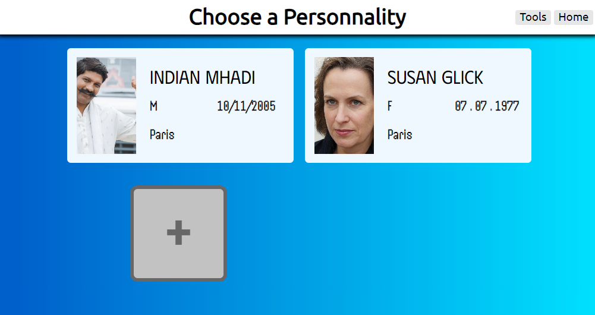
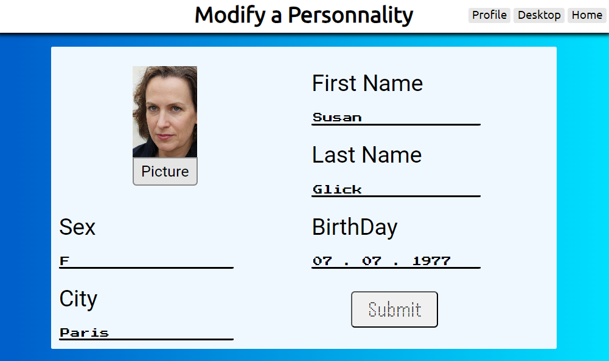

# ChooseMyLife
It's more than a simple local-password manager : yep, it's here to make easier the internet Anonymat !




## Installation 

First Step : Get the script on your laptop !
```
git clone https://github.com/MathKode/ChooseMyLife/
```
Or Download the zip here : [Zip_File](https://github.com/MathKode/ChooseMyLife/archive/refs/heads/main.zip)


### Windows

Configure the start up file
```
git clone https://github.com/MathKode/ChooseMyLife/
pip install django
cd ChooseMyLife\ChooseMyLife
@echo off
echo powershell.exe -Command "cd %cd% | python manage.py runserver" > start_up.bat
@echo on
explorer .

```
Then execute ``start_up.bat`` wherever on your laptop : it will launch the script !

If you want to find the script by the search bar, so copy the start_up.bat to :
```
%ProgramData%\Microsoft\Windows\Start Menu\Programs\
```
If you want to execute the script at every start up, so copy the start_up.bat to :
```
%APPDATA%\Microsoft\Windows\Start Menu\Programs\Startup\
```

## Illustation

Modify People Page (same as create people)


Password Manager (click on it to copy the password)

